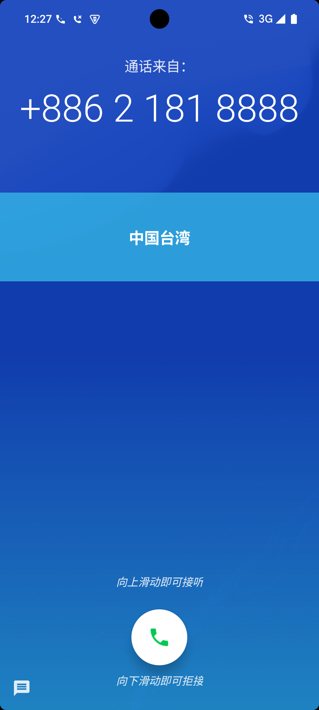
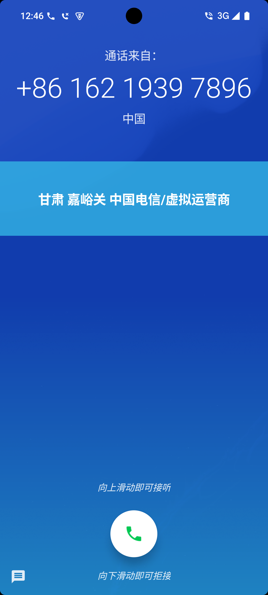
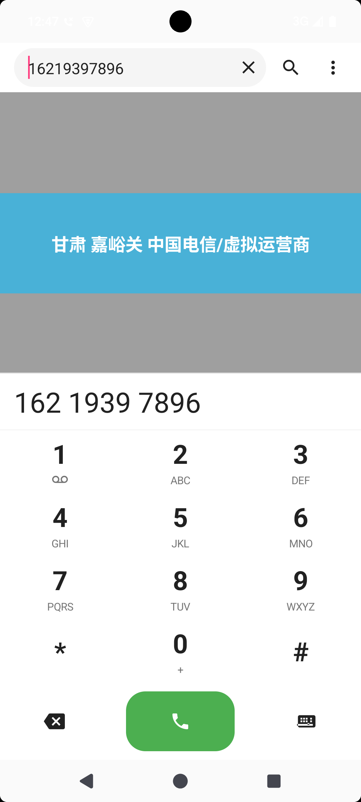
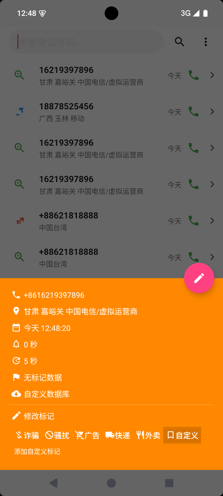
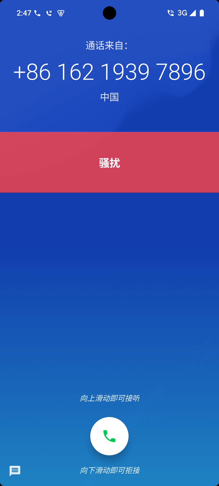
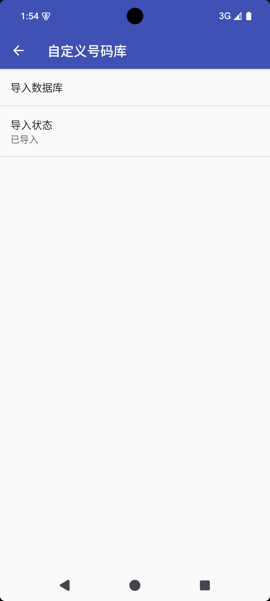

# 项目名称 CallAssistant
**来电助手-纯离线可自定义来去电归属地数据库**

> **⚠️ 重要声明：** 本项目基于原作者 xdtianyu 的[CallerInfo](https://github.com/xdtianyu/CallerInfo)项目进行二次开发，遵循 **GPLv3** 开源协议。
> 在使用、分发或修改本项目前，请确保你已阅读并理解 [GPLv3 协议全文](https://www.gnu.org/licenses/gpl-3.0.html)。

---

## 目录

- [项目简介](#1-项目简介)
- [功能特性](#2-功能特性)
- [安装与使用](#3-安装与使用)
- [屏幕截图](#4-屏幕截图)
- [鸣谢与参考](#5-鸣谢与参考)
- [许可证](#6-许可证)
- [支持与贡献](#7-支持与贡献)

---

## 1. 项目简介

本项目基于开源项目 [CallerInfo](https://github.com/xdtianyu/CallerInfo) (采用 GPLv3 协议) 进行二次开发与升级。感谢原作者 xdtianyu 的开源贡献。

**为什么二次开发？**

- 原因 1：原项目已停止维护多年，基本功能和现代安卓系统已经不兼容
- 原因 2：寻找一份全量/最新的号码归属地查询工具
- 原因 3：满足绝对隐私的需求，无需任何联网权限可自由维护的离线数据库

---

## 2. 功能特性

### 新增/增强功能

- ✅ **权限调用逻辑遵循现代Android API规范**
- ✅ **无需联网权限**：移除所有联网功能和在线API接口。
- ✅ **自定义数据库导入**：支持导入手上已有SQLite3归属地库随时扩展数据。
- ✅ **重新定义号码提取规则**
- ✅ **号码主动自定义标记**
- ✅ **仿Google原生拨号盘**
- ✅ **支持随系统深浅色主题变化**
- ✅ **通话记录（单向增量同步）**
- ✅ **通讯录（单向只读）**

### 保留特性

  - **保留了原项目的核心悬浮窗功能**
 -  **保留本地迷你数据库和Google数据库作为备用源**

### 隐私权声明
**本应用完全离线，不联网。** 本应用不会连接互联网，也不会向任何服务器收集、上传或传输您的任何个人数据。

所有功能均在设备本地完成：

**• 无任何网络请求：** 本应用未声明联网权限，也从不发起任何网络连接。

**• 仅本地数据：** 通话记录、号码标记、设置等所有数据均仅在本机保存与处理，不会上传。

**• 无账号、无追踪：** 无需注册，不含统计、广告等任何第三方 SDK。

**权限**仅用于您开启的本地功能，例如读取当前来电号码、显示来电信息悬浮窗等，这些数据不会离开您的设备。

### 来电助手（CallAssistant）功能说明
**来电助手是一款完全离线、不联网的号码识别与通话辅助工具。应用不申请联网权限，所有识别与数据处理均在本机完成，不收集、不上传您的任何数据。**
  
  🚀 **号码识别（离线识别库）**
  - 应用内置离线号码识别库自定义导入功能，对国内手机号、固话、虚拟运营商号码以及国际来电（+86/0086 前缀）进行规整与识别，自动剥离国家区号与拨号前缀。
  - 识别结果（归属地、运营商、号码类型）在首次导入时精确落库，后续秒级匹配，无需联网、不产生任何网络流量。
  
  🚀 **通话记录（单向增量同步）**
  - 应用只读取系统通话记录，采用单向增量同步机制：仅同步自上次以来新增的记录到本地，绝不修改、不删除您系统里的任何通话记录。
  - 本地新建独立的通话记录库，方便回看与回拨，与系统通话记录互不干扰。
  
  🚀 **通讯录（单向只读）**
  - 通讯录仅只读使用：仅用于在本地匹配已保存的联系人以跳过识别，不修改、不删除、不导出您的任何联系人信息。
  
  🚀 **其他功能**
  - 来电 / 去电悬浮窗，显示号码归属地及标识，一眼识别陌生来电。
  - 号码主动标记（骚扰、诈骗、广告、快递、外卖等），标记仅保存在本机。
  - 内置仿安卓原生拨号盘，支持快速拨号与一键回拨。
  - 可自定义悬浮窗位置、大小、文字样式、透明度与背景色，支持深浅色主题。
  
  **隐私承诺**
- 全程离线、无账号、无广告、无任何统计与追踪，您的数据始终留在设备本地。
  
---

## 3. 安装与使用

### 环境要求
- 理论上兼容系统版本：Android10-17 (未全面测试)
- ✅ 在小米15 Ultra Hyper OS2.0 Android15上测试通过！
### 必要权限
- 上层应用显示
- 电话
- 通话记录
- 通知(须额外：允许锁屏显示)
- 忽略电池优化
### 可选权限
- 通讯录

### 无需权限
- 存储
- 联网

### 安装步骤
安装好来电助手APK后，下载附件手机号/固话离线归属地数据库custom.db，打开来电助手的设置-自定义号码库-导入数据库，选择custom.db导入完成后，确认“导入状态”变为已导入即可。


---

## 4. 屏幕截图

### 界面预览







---

## 5. 鸣谢与参考
本项目站在巨人的肩膀上，特别感谢以下开源项目及作者：

本项目基于 [CallerInfo](https://github.com/xdtianyu/CallerInfo) 二次开发，继承并使用了以下优秀开源库：

- **PhoneNumber**: 获取号码归属地插件

- **Sugar ORM**: 数据库操作框架

- **StandOut**: 悬浮窗控制库

- **ColorPicker**: 颜色选择器

- **关于离线数据源**

  本项目内置的离线手机号码归属地数据，在项目中仅作为“离线外部数据源”挂载，抽取自开源数据集 [phone_location](https://github.com/dannyhu926/phone_location)。数据所有权归原数据集作者所有。

  
---

## 6. [许可证](https://github.com/Soinlee/CallAssistant/edit/main/LICENSE)
**本项目基于 GNU General Public License v3.0 授权。**

```
                    GNU GENERAL PUBLIC LICENSE
                       Version 3, 29 June 2007

 Copyright (C) 2007 Free Software Foundation, Inc. <http://fsf.org/>
 Everyone is permitted to copy and distribute verbatim copies
 of this license document, but changing it is not allowed.
 ```

## 7. 支持与贡献
**问题反馈**
提交 Issue 报告 bug 或建议新功能
